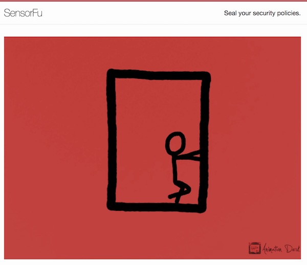

# Teaser Campaign

Howdy stranger! Congratulations! You've found our secret we so
rigorously guarded! What ever you do - DON'T TELL ANYONE!
Like... don't share this in Twitter. #sensorfuleaks

Here we plan the teaser campaign. Planned campaign principles first:

* Drop information in digestible sizes.
* Reflect ongoing activity in the web page

## Round 001 - Break out

*Have you seen a jail which focuses on preventing break-ins?*

* An animation of a man breaking out from the box.
  * Original <https://www.youtube.com/watch?v=efexDg5q7Dw>

## Round 002 - Red

* Introduce the Red theme by switching the top-border and animation color.

 * Or: <http://codeincomplete.com/games/breakout/>

## Material for next rounds

Other stuff to communicate. How?

  * Beacon (tech)?
    * Beacon animation (youtube, draw, motion)?
    * Acted in köppäily-kickstarter style?
  * Blue (product category)?
  * People?
    * last piece? parody video vs motivational up-beat hip startup
      videos? :)
  * Easy to deploy?
  * Policies?
