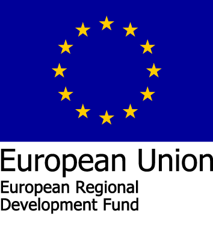
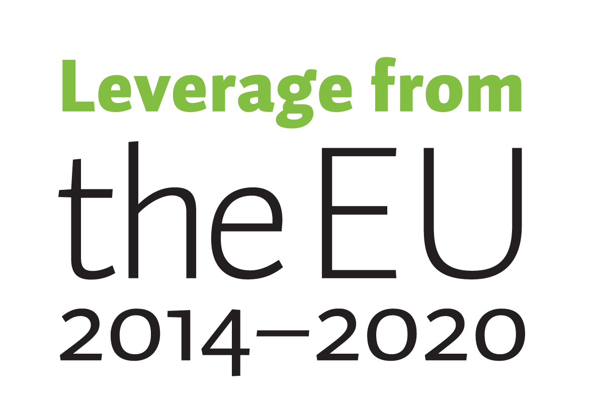

{: height="150px" }
{: height="150px" }

# SensorFu Oy productization and internationalization project

Description of the project funded by the European Regional Development Fund (ERDF).

## Summary

SensorFu Ltd manufactures and sells advanced automatic security policy checks.
SensorFu's first product, SensorFu Beacon, assures the isolation of computer
networks. With this development and internationalization project SensorFu Ltd
increases its ability to respond to international demand by improving
productization for higher delivery volumes and opening new international
channels and partnerships for the company.

## Project

* Project code: [A73663](https://www.eura2014.fi/rrtiepa/projekti.php?projektikoodi=A73663&lang=en)
* Project name: SensorFu Oy productization and internationalization project
* Policy: 2. Production and utilisation of latest knowledge and expertise
* Specific objective: 3.2. Developing renewable energy and energy-efficient solutions
* Planned completion time: Start 26.2.2018 and end 27.2.2019
* Responsible authority: Centre for Economic Development, Transport and the Environment North Ostrobothnia

## Basic applicant information

* Official name of the applicant: SENSORFU OY
* Organisation type: Micro-enterprise
* Business ID: 2811349-6
* Street: Teknologiantie 18 B
* Telephone number: +358 40 8019800
* Postal code: 90590
* City/town: OULU
* Website: [https://www.sensorfu.com](https://www.sensorfu.com)
* Project contact person's name: Kenttälä Mikko
* Contact person's position in the organisation: CEO
* Contact person’s email address: mikko.kenttala(at)sensorfu.com
* Contact person's phone number: +358408019800

## Public funding of the project (EUR)

* EU and State funding granted: 102 480
* Planned public funding (total): 102 480

## Geographical target area

* Regions: Northern Ostrobothnia
* Subregions: Oulu
* Municipalities: Oulu
* Address of the project site, if the project is carried out in one place
* Street: Teknologiantie 18 B
* Postal code: 90590
* City/town: OULU
