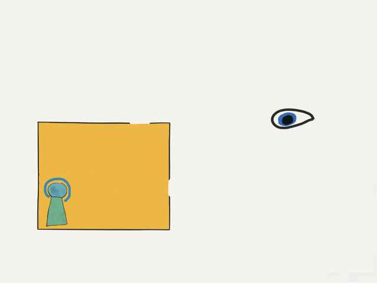

<!-- markdownlint-disable MD041 -->
<!-- markdownlint-disable MD013 -->
<!-- markdownlint-disable MD036 -->

*Captors placed a Beacon inside to make sure the wall is solid.*
<!-- markdownlint-enable MD041 -->
<!-- markdownlint-enable MD013 -->
<!-- markdownlint-enable MD036 -->
